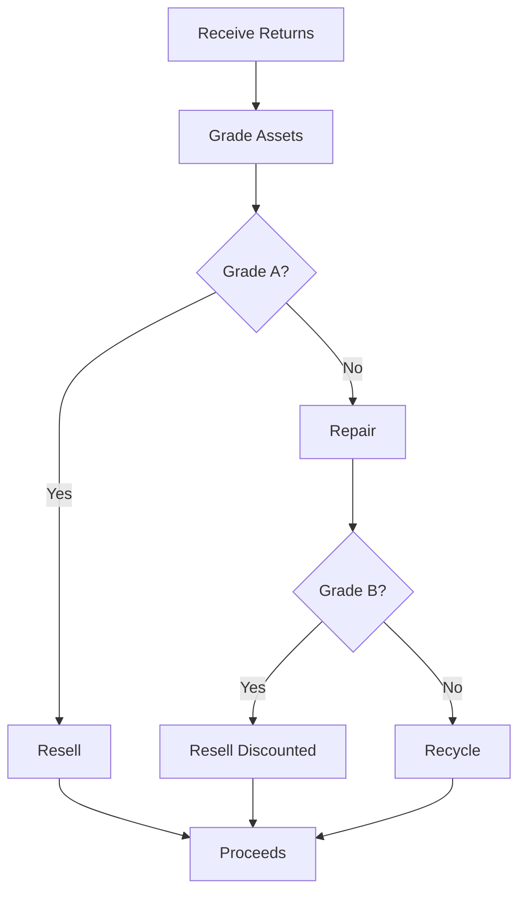

## Overview

NorAm International Partners delivers tailored asset recovery and 3PL fulfillment solutions for media, consumer electronics, and consumer goods. You recover value from returns through grading, repair, and resale while streamlining B2B and B2C logistics. These services minimize waste and maximize returns on inventory.

<Callout kind="info">
  NorAm handles over `{1M+}` units annually across markets, ensuring compliance with industry standards like R2 for electronics.
</Callout>

## Key Services

<Columns cols={3}>
  <Card title="Asset Recovery" icon="recycle" href="/docs/asset-recovery/process">
    Grade, repair, and resell returned assets to recapture `{80%+}` of value.
  </Card>
  <Card title="3PL Fulfillment" icon="package" href="/docs/3pl/models">
    Scale B2B/B2C operations with kitting, storage, and shipping.
  </Card>
  <Card title="Specialized Logistics" icon="truck" href="/docs/specialized/handling">
    Custom solutions for fragile media and high-value electronics.
  </Card>
</Columns>

## Asset Recovery Process

Follow these steps to integrate NorAm's asset recovery into your supply chain.

<Steps>
  <Step title="Receive Returns" icon="inbox">
    Ship returns to NorAm facilities. Track via `{tracking_id}` in your dashboard.
  </Step>
  <Step title="Grade Assets" icon="search">
    NorAm grades items based on condition: `{Grade A}` (resell), `{Grade B}` (repair), `{Grade C}` (recycle).
  </Step>
  <Step title="Repair & Kitting" icon="tools">
    Repair electronics or kit media bundles for resale.
  </Step>
  <Step title="Resell or Dispose" icon="shopping-cart">
    Receive proceeds from resale or recycling credits.
  </Step>
</Steps>



## 3PL Fulfillment Models

Choose the right model based on your business needs.

<Tabs>
  <Tab title="B2B Fulfillment" icon="users">
    Bulk order processing for distributors.
    
    <CodeGroup tabs="JSON,XML">
      ```json
      {
        "order_type": "B2B",
        "sku": "ELEC-TV456",
        "quantity": 500,
        "destination": "warehouse-partner.com"
      }
      ```
      ```xml
      <order>
        <type>B2B</type>
        <sku>ELEC-TV456</sku>
        <quantity>500</quantity>
      </order>
      ```
    </CodeGroup>
  </Tab>
  <Tab title="B2C Fulfillment" icon="user">
    Direct-to-consumer shipping with kitting.
    
    <CodeGroup tabs="JSON,XML">
      ```json
      {
        "order_type": "B2C",
        "sku": "MEDIA-DVD789",
        "quantity": 1,
        "kit_items": ["case", "manual"],
        "ship_to": "customer-address"
      }
      ```
      ```xml
      <order>
        <type>B2C</type>
        <sku>MEDIA-DVD789</sku>
        <kit_items>
          <item>case</item>
          <item>manual</item>
        </kit_items>
      </order>
      ```
    </CodeGroup>
  </Tab>
</Tabs>

## Specialized Handling by Market

NorAm customizes processes for sensitive products.

<ExpandableGroup>
  <Expandable title="Media Products" default-open="true">
    Handle discs, tapes, and packaging to prevent damage. Use anti-static bags and climate-controlled storage.
  </Expandable>
  <Expandable title="Consumer Electronics">
    ESD-safe handling for TVs, laptops. Comply with `{RoHS}` and `{WEEE}` regulations.
  </Expandable>
  <Expandable title="Consumer Goods">
    Kitting for bundles like toys + accessories. High-volume picking for seasonal peaks.
  </Expandable>
</ExpandableGroup>

<Callout kind="tip">
  Integrate via API for real-time inventory tracking. Start with `{POST /api/returns}` endpoint.
</Callout>