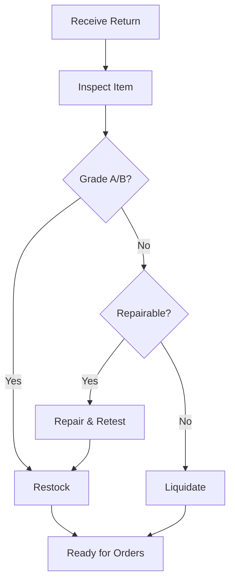

## Overview

NorAm provides end-to-end fulfillment services tailored for B2B and B2C operations in media, consumer electronics, and consumer goods. You receive customized workflows that handle picking, packing, shipping, kitting, and returns grading with precision. These services ensure scalable, reliable delivery for your business needs.

<Columns cols={2}>
  <Card title="B2B Fulfillment" icon="package" href="#b2b-fulfillment">
    Bulk order processing for business clients with custom palletization.
  </Card>
  <Card title="B2C Fulfillment" icon="shopping-cart" href="#b2c-fulfillment">
    Direct-to-consumer shipping with branded packaging and tracking.
  </Card>
  <Card title="Kitting Services" icon="layers" href="#kitting">
    Assembly of custom kits from multiple SKUs.
  </Card>
  <Card title="Returns Management" icon="rotate-ccw" href="#returns">
    Grading, repair, and restocking of returned items.
  </Card>
</Columns>

<Callout kind="info">
  All services integrate with your warehouse management system (WMS) via API for real-time inventory sync.
</Callout>

## B2B Fulfillment Workflow

Streamline your wholesale orders with NorAm's B2B process. You submit orders electronically, and we handle fulfillment from receipt to delivery.

<Steps>
  <Step title="Order Submission" icon="upload">
    Send your order via API or EDI with details like `ORD-12345` and pallet requirements.
  </Step>
  <Step title="Picking and Packing" icon="package">
    Warehouse team picks items using your SKUs, such as `SKU-ELEC-456` for electronics.
  </Step>
  <Step title="Quality Check" icon="check-circle">
    Verify quantities and palletize for B2B shipment standards.
  </Step>
  <Step title="Shipping" icon="truck">
    Ship via LTL or FTL carriers with tracking provided back to you.
  </Step>
</Steps>

Here is a sample order payload:

<CodeGroup tabs="JSON,XML">
```json
{
  "orderId": "ORD-12345",
  "customerId": "BIZ-789",
  "items": [
    {
      "sku": "SKU-ELEC-456",
      "quantity": 500,
      "palletQty": 10
    }
  ],
  "shipTo": "123 Business Park, Logistics City"
}
```
```xml
<Order id="ORD-12345">
  <Customer id="BIZ-789"/>
  <Item sku="SKU-ELEC-456" quantity="500" palletQty="10"/>
  <ShipTo>123 Business Park, Logistics City</ShipTo>
</Order>
```
</CodeGroup>

## B2C Fulfillment

For direct consumer orders, NorAm offers same-day processing with personalized packaging. Compare workflows across platforms below.

<Tabs>
  <Tab title="E-commerce Platforms" icon="globe">
    Integrate with Shopify or Amazon for automated order import.
    
    <Steps>
      <Step title="Order Import" icon="download">
        Pull orders from your platform API.
      </Step>
      <Step title="Pick and Pack" icon="box">
        Use single-item polybags with your branding.
      </Step>
    </Steps>
  </Tab>
  <Tab title="Custom DTC" icon="shopping-bag">
    Upload CSV files for standalone fulfillment.
    
    ```csv
    orderId,sku,quantity,shipToName,shipToAddress
    ORD-67890,SKU-MEDIA-111,1,John Doe,456 Home St
    ```
  </Tab>
</Tabs>

## Kitting and Assembly Services

Build custom kits efficiently. You specify components, and NorAm assembles them into shippable units.

<Steps>
  <Step title="Kit Specification" icon="file-text">
    Provide bill of materials (BOM) like electronics bundle with `SKU-ELEC-456` + `SKU-CABLE-789`.
  </Step>
  <Step title="Assembly" icon="tool">
    Labor team kits items with quality seals.
  </Step>
  <Step title="Labeling and Storage" icon="tag">
    Apply kit labels and store for just-in-time fulfillment.
  </Step>
</Steps>

## Returns Grading and Repair

Manage returns with our structured grading process. Items receive condition scores for resale or repair.

| Grade | Condition Description | Action Taken |
|-------|-----------------------|--------------|
| A     | Like new, unopened    | Restock immediately |
| B     | Opened, functional    | Sanitize and repack |
| C     | Minor damage          | Repair in-house |
| D     | Non-functional        | Liquidate or recycle |

<Expandable title="Repair Procedures" default-open="false">

Follow these steps for C-grade items:

1. Diagnose issue (e.g., cable fault on `SKU-ELEC-456`).
2. Repair using certified parts.
3. Test functionality.
4. Regrade to B or A.

</Expandable>



<Callout kind="tip">
  Track returns via our portal using `RETURN-54321` IDs for full visibility.
</Callout>