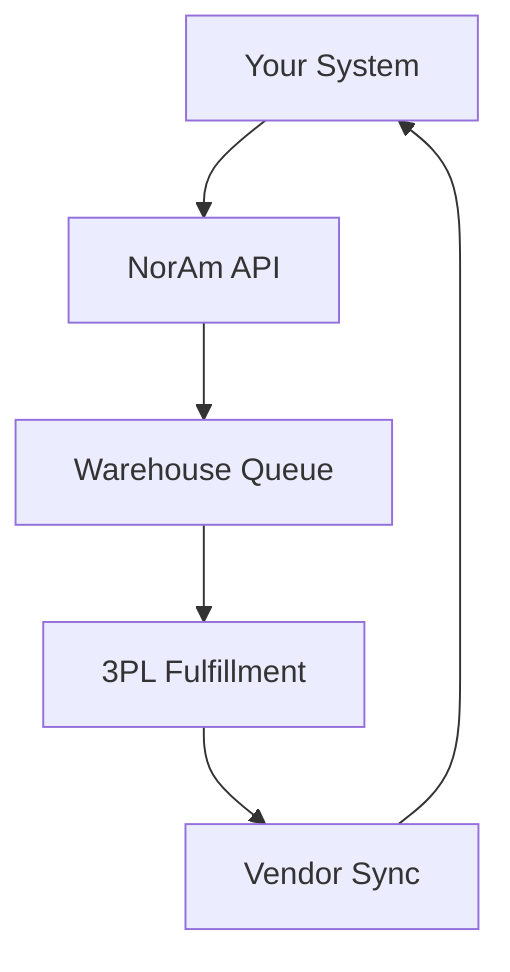

## Overview

NorAm Partners enables seamless integrations with your existing systems for asset recovery, 3PL fulfillment, and logistics operations. You can connect via our RESTful API, collaborate with vendors using dedicated tools, and scale effortlessly as your business grows. Start by reviewing the integration types below.

<Columns cols={3}>
  <Card title="API Integrations" icon="zap" href="#api-integrations">
    Automate fulfillment, returns processing, and inventory sync with our API.
  </Card>
  <Card title="Vendor Tools" icon="users" href="#vendor-tools">
    Share real-time data and coordinate kitting, grading, and repairs.
  </Card>
  <Card title="Scalability" icon="trending-up" href="#scalability">
    Handle increased volume without downtime or reconfiguration.
  </Card>
</Columns>

## API Integrations

Build robust connections to NorAm's services using our API. Authenticate with an API key and make HTTPS requests to endpoints like shipment tracking and order fulfillment.

<Callout kind="info">
  Generate your API key from the NorAm dashboard under Account > API Keys. Store it securely as `YOUR_API_KEY`.
</Callout>

### Get Started with the API

Follow these steps to integrate:

<Steps>
  <Step title="Obtain API Key" icon="key">
    Log in to your NorAm dashboard and navigate to API settings. Copy the generated key.
  </Step>
  <Step title="Install SDK" icon="download">
    Use our official SDKs for your language.
  </Step>
  <Step title="Make First Request" icon="play">
    Test the shipments endpoint.
  </Step>
</Steps>

<CodeGroup tabs="JavaScript,Python">
  ```javascript
  const response = await fetch('https://api.norampartners.com/v1/shipments', {
    method: 'GET',
    headers: {
      'Authorization': `Bearer ${YOUR_API_KEY}`,
      'Content-Type': 'application/json'
    }
  });
  const data = await response.json();
  console.log(data);
  ```
  ```python
  import requests

  headers = {
      'Authorization': f'Bearer {YOUR_API_KEY}',
      'Content-Type': 'application/json'
  }
  response = requests.get('https://api.norampartners.com/v1/shipments', headers=headers)
  data = response.json()
  print(data)
  ```
</CodeGroup>

### Shipment Creation Endpoint

<ParamField path="warehouseId" param-type="string" required="true">
  Your assigned warehouse identifier, e.g., `wh_abc123`.
</ParamField>

<ParamField body="items" param-type="array" required="true">
  Array of items with `sku`, `quantity`, and `condition`.
</ParamField>

<Request tabs="JavaScript,cURL">
  ```javascript
  await fetch('https://api.norampartners.com/v1/shipments', {
    method: 'POST',
    headers: {
      'Authorization': `Bearer ${YOUR_API_KEY}`,
      'Content-Type': 'application/json'
    },
    body: JSON.stringify({
      warehouseId: 'wh_abc123',
      items: [{ sku: 'LAPTOP-XYZ', quantity: 5, condition: 'new' }]
    })
  });
  ```
  ```bash
  curl -X POST https://api.norampartners.com/v1/shipments \
    -H "Authorization: Bearer YOUR_API_KEY" \
    -H "Content-Type: application/json" \
    -d '{
      "warehouseId": "wh_abc123",
      "items": [{"sku": "LAPTOP-XYZ", "quantity": 5, "condition": "new"}]
    }'
  ```
</Request>

<Response tabs="200,400">
  ```json
  {
    "id": "ship_123456",
    "status": "created",
    "trackingUrl": "https://track.norampartners.com/ship_123456"
  }
  ```

  ```json
  {
    "error": "Invalid warehouseId",
    "code": "INVALID_PARAM"
  }
  ```
</Response>

## Vendor Collaboration Tools

Collaborate with partners for B2B fulfillment, kitting, and returns grading. Use our portal or API webhooks for real-time updates.

<Tabs>
  <Tab title="Web Portal" icon="globe">
    Access shared dashboards at `https://portal.norampartners.com`. Invite vendors via email and track joint projects.

    <Image
      src="https://via.placeholder.com/800x400/ cbcd3e/ffffff?text=Vendor+Portal+Dashboard"
      alt="Vendor collaboration portal dashboard"
      width="800"
      height="400"
    />
  </Tab>
  <Tab title="Webhooks" icon="zap">
    Set up webhooks for events like shipment updates.

    ```javascript
    // POST to your endpoint: https://your-webhook.norampartners.com/events
    {
      "event": "shipment.updated",
      "data": {
        "id": "ship_123456",
        "status": "in_transit"
      }
    }
    ```
  </Tab>
</Tabs>

## Scalability for Growing Businesses

NorAm handles high-volume operations with auto-scaling warehouses and API rate limits exceeding `>10,000` requests per minute.

<Expandable title="Advanced Scaling Options" default-open="false">

Enable queueing for peak loads:

```javascript
// Set queue mode in headers
headers: {
  'X-Queue-Mode': 'true',
  'Authorization': `Bearer ${YOUR_API_KEY}`
}
```

Monitor usage via the dashboard Metrics tab.

</Expandable>



<Callout kind="tip">
  Contact support@norampartners.com for custom enterprise scaling plans supporting `>1M` orders monthly.
</Callout>