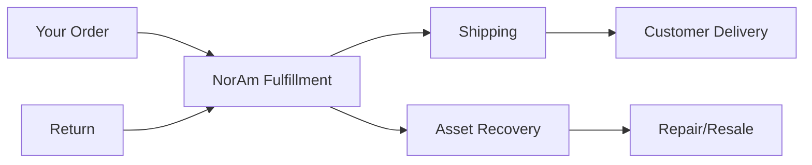

## Overview

NorAm International Partners delivers comprehensive logistics solutions tailored for your business needs. You partner with us to streamline asset recovery, 3PL fulfillment, and supply chain operations across media, consumer electronics, and consumer goods sectors. Our expertise ensures efficient B2B and B2C fulfillment, kitting, returns grading, and repairs.

<Callout kind="success">
NorAm's mission focuses on sustainable asset recovery and customized 3PL services, helping you reduce costs and improve recovery rates by up to 30%.
</Callout>

## Core Services

Explore our key offerings designed to optimize your logistics.

<Columns cols={3}>
  <Card title="Asset Recovery" icon="recycle" href="/docs/asset-recovery">
    Recover value from returned or end-of-life assets through grading, repair, and resale.
  </Card>
  <Card title="3PL Fulfillment" icon="package" href="/docs/3pl-fulfillment">
    Handle B2B and B2C order fulfillment, including picking, packing, and shipping.
  </Card>
  <Card title="Kitting & Repair" icon="tools" href="/docs/kitting-repair">
    Assemble kits and perform repairs to extend product life and meet market demands.
  </Card>
</Columns>

## Markets We Serve

NorAm tailors solutions for specific industries. Select your market to view relevant capabilities.

<Tabs>
  <Tab title="Media" icon="play-circle">
    Manage high-volume returns for DVDs, Blu-rays, and streaming media devices. Our grading process ensures quality resale.
  </Tab>
  <Tab title="Consumer Electronics" icon="smartphone">
    Handle complex repairs for smartphones, laptops, and accessories with certified technicians.
  </Tab>
  <Tab title="Consumer Goods" icon="shopping-bag">
    Support seasonal fulfillment spikes for apparel, toys, and household items with scalable 3PL.
  </Tab>
</Tabs>

## Benefits for Partners

Partnering with NorAm provides measurable advantages:

- **Cost Savings**: Reduce logistics expenses through efficient recovery and fulfillment.
- **Scalability**: Scale operations without upfront infrastructure investments.
- **Sustainability**: Maximize asset reuse to minimize waste and support green initiatives.
- **Speed**: Achieve `<48-hour` turnaround for fulfillment and repairs.

## Get Started with Our API

Integrate NorAm's tracking and fulfillment APIs to monitor shipments in real-time.

<Steps>
  <Step title="Sign Up" icon="user-plus">
    Create an account at [app.norampartners.com](https://app.norampartners.com) to get your `API_KEY`.
  </Step>
  <Step title="Track a Shipment" icon="search">
    Use our tracking endpoint.
  </Step>
  <Step title="Go Live" icon="rocket">
    Connect to production and automate your workflows.
  </Step>
</Steps>

<CodeGroup tabs="JavaScript,Python,cURL">
  ```javascript
  const response = await fetch('https://api.norampartners.com/v1/track', {
    method: 'POST',
    headers: {
      'Authorization': `Bearer ${YOUR_API_KEY}`,
      'Content-Type': 'application/json'
    },
    body: JSON.stringify({ trackingId: 'SHIP123456' })
  });
  const data = await response.json();
  console.log(data.status);
  ```
  ```python
  import requests

  headers = {
      'Authorization': f'Bearer {YOUR_API_KEY}',
      'Content-Type': 'application/json'
  }
  response = requests.post(
      'https://api.norampartners.com/v1/track',
      json={'trackingId': 'SHIP123456'},
      headers=headers
  )
  print(response.json()['status'])
  ```
  ```bash
  curl -X POST https://api.norampartners.com/v1/track \
    -H "Authorization: Bearer YOUR_API_KEY" \
    -H "Content-Type: application/json" \
    -d '{"trackingId": "SHIP123456"}'
  ```
</CodeGroup>

<Expandable title="Frequently Asked Questions" default-open="false">
### What makes NorAm different?
Our combination of asset recovery and 3PL services provides end-to-end solutions not found elsewhere.

### How do I contact support?
Reach our team via the partner portal or email `partners@norampartners.com`.
</Expandable>



This introduction equips you to leverage NorAm's services effectively. Dive into specific docs via the navigation.